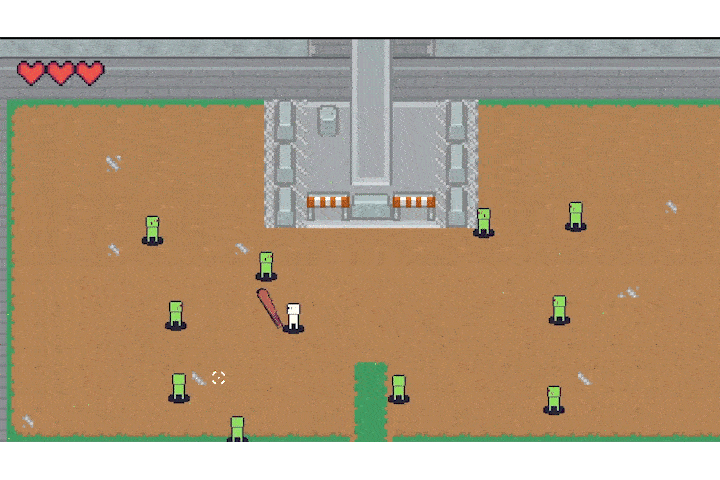

# About
To The Vault was Solo developed in 15 days as a personal challenge to improve my 2D game skills. This prototype outlines a simple roguelike where you progress through rooms of enemies with a final boss you must beat to win the game. This project was done during the Winter of 2023. 

  

# GDD
When developing this game, I created a Game Design Document to ensure that I remained consistent while maintaining scope. If you want to check out the GDD, I've provided a link below for the original Google Document.  
<a href="https://docs.google.com/document/d/1Enjbg2BqjIkJKOGSNxWoIdQfC97vkXqm5n9HwrVRxaI/edit?usp=sharing">Adam Kaci | To The Vault GDD</a>

# Interested in playing?

To The Vault is publicly available to play on Itch.io. If you're interested, click the image below, and it'll redirect you to the games page!

  
   

